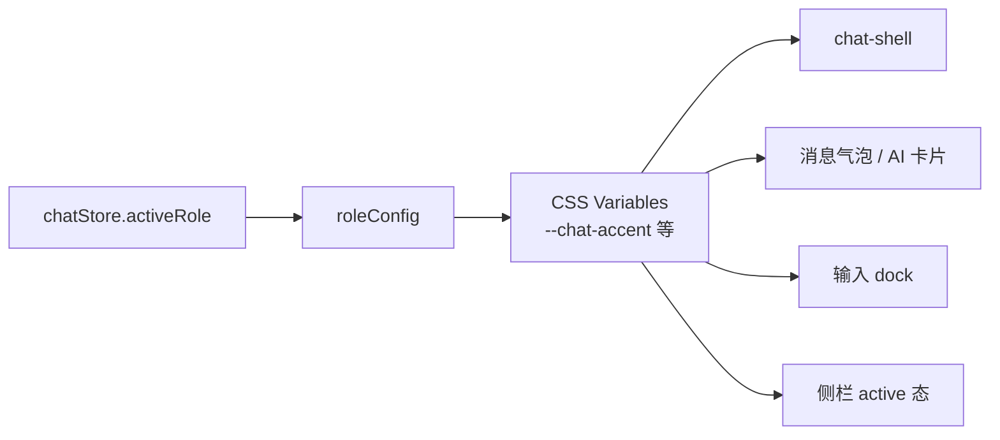

# Chat UI 角色剧场（Role Theatre）设计说明书

## 概述

在现有三栏 Chat 布局基础上，对聊天界面进行第二轮视觉升级。核心概念为 **「角色剧场」**：用户切换 AI 角色时，聊天区 accent 色、消息卡片、输入区、侧栏高亮联动变化，使 5 个性格鲜明的角色（智能助手、英语大师、商务英语、麒麟哥、小满模式）拥有独立视觉氛围。

**视觉原型（唯一参考）**：项目根目录 [`chat-ui-design.html`](../../../chat-ui-design.html)（v3）

**前置 spec（部分已实现）**：
- [2026-06-11-chat-three-column-design.md](./2026-06-11-chat-three-column-design.md) — 三栏布局、对话 CRUD、Pinia store（已完成）
- [2026-06-12-chat-ui-redesign-design.md](./2026-06-12-chat-ui-redesign-design.md) — 欢迎页、侧栏、容器样式（部分完成）

本 spec **取代** 2026-06-12 中「不改动聊天气泡」的限制，将对话区、输入区、**Chat 区内顶栏（ChatTopbar）** 纳入改造范围。

---

## 范围边界（硬性约束）

**只做 AI 聊天页**，以下区域 **零改动**：

| 禁止修改 | 路径 / 说明 |
|----------|-------------|
| 全局顶部导航栏 | `apps/web/src/layout/Header/index.vue` — Logo、主页/聊天/词库/课程/设置、签到徽章、用户头像 **一切保持现状** |
| 全局 Layout | `apps/web/src/layout/index.vue`、`Content/index.vue` |
| 其他业务页面 | 主页、词库、课程、设置等 views |
| 后端 / API / SSE | 不变 |

**改造范围**仅包含 `apps/web/src/views/Chat/**` 及 Chat 专用样式文件。

**关于设计稿 HTML**：`chat-ui-design.html` 内嵌的 `app-header` 仅为 **预览用假壳**，模拟全页效果；**落地 Vue 时不实现、不替换** 真实全局 Header。验收以 Header 下方 `chat-shell` 三栏区域为准。

---

## 背景

### 现状（2026-06-23）

| 区域 | 实现状态 | 问题 |
|------|----------|------|
| 三栏布局 + 路由 + store | 已完成 | — |
| 左栏 RoleList | 部分完成 | 仍用裸 emoji，无渐变 icon box，active 写死 indigo |
| 中栏 ConversationList | 部分完成 | 背景与左栏同色，未分层；新建按钮写死 indigo |
| 欢迎页 WelcomeScreen | 部分完成 | 无渐变标题、无「推荐」卡片、无操作提示 |
| **右栏对话区** | **未升级** | 蓝色用户气泡 + 灰色 AI 方块，与原型差距最大 |
| **输入区** | **未升级** | Element Plus 默认 textarea，无 floating dock |
| **Chat 区内顶栏（ChatTopbar）** | **缺失** | 无对话标题 + role chip（**不是**全局导航栏） |
| 全局 Header | 已完成，**不在本 spec 范围** | 不修改、不重构、不对齐设计稿 mock header |

### 设计目标

1. 对话区视觉达到 `chat-ui-design.html` v3 水准
2. 5 个角色切换时，accent 主题联动（非全局 indigo）
3. 不改动 SSE、store、API、后端逻辑
4. 无新增 npm 依赖（Tailwind CSS + 现有 marked/hljs + Google Fonts）

---

## 设计概念：角色剧场



**原则**：
- 角色 emoji **仅**用于 5 个 AI persona（侧栏、AI 头像、role chip）
- Chat 区内操作控件（toggle、发送/麦克风）使用 **SVG 图标**，不用 emoji
- 欢迎页卡片内 emoji 保留（快捷入口语义清晰）
- 不添加未实现功能的 UI（如对话搜索框）
- **全局 Header 导航**保持 Element Plus 图标 + 现有样式，本 spec 不涉及

---

## 布局架构

### 页面结构

Chat 页仍嵌入全局 `layout/Header`，下方为三栏卡片：

```
layout/Header（全局，已有）
└── views/Chat/index.vue（chat-shell，1200px 卡片）
    ├── RoleList.vue          208px  背景 #fafaff 渐变
    ├── ConversationList.vue  268px  背景 #fefefe 白色
    └── ChatArea.vue          flex-1
        ├── ChatTopbar.vue    有对话时显示
        ├── WelcomeScreen     无对话时显示
        ├── 消息列表区         max-width 720px 居中
        └── ChatInputDock.vue  始终显示
```

### 容器尺寸

```html
<div
  class="chat-shell w-[1200px] mx-auto flex my-10 rounded-[24px] overflow-hidden bg-white ..."
  :style="{ ...roleThemeVars(activeRole), height: 'calc(100vh - 160px)' }"
>
```

阴影：`0 0 0 1px rgba(0,0,0,.04), 0 12px 40px rgba(0,0,0,.08)`

### 与全局 Header 的关系

- 全局 Header 由 `layout/Header` 渲染，**本 spec 禁止修改该组件**
- Chat 内容区在 Header **下方**，由 `views/Chat/index.vue` 的 `chat-shell` 卡片承载
- `chat-shell` 独立圆角阴影；与 Header 之间仅保留现有 `my-10` 间距
- 设计稿 HTML 顶部的 mock 导航 **不得**移植到 Vue；实现时用户看到的导航栏仍是当前线上版本（见截图：E Logo、English App、Element Plus 图标、blue-200 active）

---

## 设计 Token

### 字体

仅在 Chat 模块生效，避免影响其他页面：

- 在 `chat-theme.css` 顶部 `@import` Google Fonts，或仅在 Chat 相关组件根节点设置 `font-family`
- **不修改** `layout/Header` 字体

| 用途 | 字体 |
|------|------|
| Chat UI 文字、按钮、侧栏 | Plus Jakarta Sans |
| 欢迎页标题、Markdown h3 | Source Serif 4 |

**加载策略**（写在 `chat-theme.css` 顶部，仅 Chat 模块引用时生效）：

```css
@import url('https://fonts.googleapis.com/css2?family=Plus+Jakarta+Sans:wght@400;600;700&family=Source+Serif+4:wght@600&display=swap');
```

- 只加载所需 weight：Jakarta **400 / 600 / 700**，Serif **600**（欢迎页标题 + Markdown h3）
- 使用 `display=swap`，避免 FOIT
- **不修改** `layout/Header` 字体；其他页面不 import `chat-theme.css` 则不受影响

### CSS 变量（注入 chat-shell）

| 变量 | 说明 |
|------|------|
| `--chat-accent` | 主色：用户气泡、发送按钮、AI 卡片顶条 |
| `--chat-accent-dark` | 渐变深色端 |
| `--chat-accent-light` | 渐变浅色端 |
| `--chat-accent-soft` | 浅背景：active 侧栏项、role chip、表格 thead |
| `--chat-accent-border` | 边框色 |
| `--chat-accent-text` | 深色文字 |
| `--chat-icon-bg` | 角色 icon box 渐变 |
| `--chat-glow` | focus ring / hover 阴影 |
| `--chat-bubble-shadow` | 用户气泡阴影 |

### 五角色配色

| 角色 | accent | accentSoft | 气质 |
|------|--------|------------|------|
| normal 智能助手 | `#6366f1` | `#eef2ff` | 理性工具 |
| master 英语大师 | `#7c3aed` | `#f5f3ff` | 学术专业 |
| business 商务英语 | `#2563eb` | `#eff6ff` | 职场信任 |
| qilinge 麒麟哥 | `#e11d48` | `#fff1f2` | 活泼戏谑 |
| xiaoman 小满模式 | `#0891b2` | `#ecfeff` | 程序员冷静 |

### 聊天主区背景

- 底色：`#faf9f6`（暖纸色）
- 右上角：radial-gradient ambient glow（`var(--chat-glow)`）
- 可选：极淡 noise 纹理（opacity 0.025）

---

## 组件规格

### 1. roleConfig.ts（扩展）

在现有 `RoleInfo` 上增加：

```ts
export interface RoleTheme {
  accent: string
  accentDark: string
  accentLight: string
  accentSoft: string
  accentBorder: string
  accentText: string
  iconBg: string
}

export interface RoleInfo {
  label: string        // 显示名，如「智能助手」
  icon: string
  desc: string
  greeting: string
  subtitle: string
  cards: RoleCard[]
  theme: RoleTheme
}

export function roleThemeVars(role: ChatRoleType): Record<string, string>
```

`label` 用于 ChatTopbar role chip 和 AI 卡片 header，与后端 `ChatMode.label` 去 emoji 后一致。

### 2. RoleList.vue（左栏）

| 属性 | 规格 |
|------|------|
| 宽度 | 208px |
| 背景 | `linear-gradient(180deg, #fafaff, #f5f4ff)` |
| 每项 | 38×38 圆角 icon box（`theme.iconBg`）+ 名称 + 描述 |
| active | 背景 `accentSoft`、边框 `accentBorder`、左侧 inset 3px accent 条、微 glow |
| hover | 半透明白底 |

### 3. ConversationList.vue（中栏）

| 属性 | 规格 |
|------|------|
| 宽度 | 268px |
| 背景 | `#fefefe`（与左栏分层） |
| 新建按钮 | 30×30 圆角方块，渐变 `accent → accentDark`，阴影跟随角色 |
| 列表项 active | 背景 accentSoft、圆点指示器（6px accent 色 + glow） |
| 删除按钮 | hover 显示，红色小方块 |
| 空状态 | 图标卡片 + 「暂无对话」+ 「点击上方 + 开始新对话」 |
| **不做** | 搜索框（v1 不实现） |

### 4. ChatTopbar.vue（新增）

**显示条件**：`chatStore.activeConversationId !== null`

| 元素 | 规格 |
|------|------|
| 左侧 | 对话标题（`activeConversation.title`），超长 ellipsis |
| 右侧 | role chip：`{icon} {label}`，accentSoft 背景 |
| 流式时 | 额外显示「停止生成」按钮（见下方「停止生成」行为） |
| 背景 | 半透明白 + 底部分割线 |

**停止生成行为**（用户点击顶栏按钮或 Esc）：

1. 调用已有 `abortController.abort()`
2. **保留** AI 消息已接收的 `content` / `reasoning`（不清空）
3. 设 `streaming = false`；若 `content` 非空则按完成态渲染 Markdown
4. **不**走 `status = 'error'`（用户主动中断 ≠ 网络/服务端错误）
5. SSE `error` 回调中区分 `AbortError`：若是用户 abort，静默结束，不显示红色 error-box
6. 可选：卡片 footer 显示灰色「已中断」文案（12px `#a8a29e`），仅当 `content` 非空且被中断时

### 5. WelcomeScreen.vue（升级）

| 元素 | 规格 |
|------|------|
| 背景光晕 | `.welcome-orb` radial gradient |
| 问候语 | Source Serif 4，36px，渐变字（`#1c1917 → accent`） |
| 副标题 | 15px `#78716c` |
| 操作提示 | 「选择快捷卡片，或直接在下方输入」，12px `#a8a29e` |
| 卡片 | 3 张；**第一张**加 `featured` 宽度 + 「推荐」徽章 |
| 卡片 hover | 上浮 5px、accent 色阴影、底部 accent 渐变条 |
| 动画 | 卡片 stagger fadeInUp（0.05s / 0.12s / 0.19s delay） |

**行为不变**：`emit('selectCard', placeholder, toggle?)`

### 6. ChatMessage.vue（新增）

负责单条消息渲染，替代 ChatArea 内联模板。

#### 用户消息

- 布局：右对齐，头像在右
- 气泡：渐变 `accentLight → accent → accentDark`
- 圆角：`18px 18px 6px 18px`
- 阴影：`var(--chat-bubble-shadow)`
- 头像：40px 圆形，双层 ring

#### AI 消息 — 卡片式

```
┌─ ● 智能助手 ──────────── 刚刚 ─┐  ← header + 在线绿点
│ ▓▓▓▓▓▓▓▓▓▓▓▓▓▓▓▓▓▓▓▓▓▓▓▓▓▓▓ │  ← 顶部 3px accent 渐变条
│ [tool pill]                  │
│ [reasoning bar ▼]            │
│ Markdown / stream 内容       │
└──────────────────────────────┘
```

| 子状态 | 视觉 |
|--------|------|
| loading | 三点 bounce（accent 色） |
| tool_calling | 黄色 pending pill + tool detail |
| tool_done | 绿色 done pill |
| reasoning | 可折叠 gray bar，展开显示全文 |
| streaming | 纯文本 + 闪烁 cursor |
| error | 红色 error-box + 「重试」按钮 |
| 完成 | `deepseek-markdown` 渲染（class 改为 `chat-md`） |

#### tool 类型独立消息（`type === 'tool'`）

- 仍作为列表独立项渲染
- 视觉：与 AI 卡片内 tool pill 一致，左对齐缩进与 AI 列对齐
- 点击展开 input/output detail

### 7. ChatInputDock.vue（新增）

替换 Element Plus `el-input textarea`。

| 元素 | 规格 |
|------|------|
| 外层 | 渐变透明 → 白底，max-width 720px 居中 |
| toggle | SVG + 文字；深度思考用 accent 色 active；联网搜索用 blue active；互斥逻辑不变 |
| 输入框 | 白底、圆角 18px、阴影；focus 时 accent ring（4px glow） |
| textarea | 自实现 auto-resize（min 46px, max 120px） |
| 按钮 | 38×38 圆角 12px；发送=accent 渐变；麦克风=边框样式 |
| 字数 | 右下 `n / 4000`；流式时改为「按 Esc 或点击停止生成中断」 |
| 禁用态 | 流式/工具调用中：opacity 0.5，发送按钮变 stop 图标 |

**auto-resize 实现**（原生 `<textarea>`，`@input` 触发）：

```ts
const MIN_HEIGHT = 46
const MAX_HEIGHT = 120

function autoResize(e: Event) {
  const el = e.target as HTMLTextAreaElement
  el.style.height = 'auto'
  el.style.height = `${Math.min(Math.max(el.scrollHeight, MIN_HEIGHT), MAX_HEIGHT)}px`
}
```

- 发送成功后重置 `height` 为 `MIN_HEIGHT`
- `overflow-y: auto` 仅在达到 `MAX_HEIGHT` 时生效

**行为不变**：
- Enter 发送（Shift+Enter 换行）
- 语音结束后自动 sendMessage
- deepThink / webSearch 互斥

### 8. chat-theme.css（新增）

集中存放：
- Google Fonts `@import`（见「字体」节）
- `.chat-main` 背景与 glow
- `.chat-md` Markdown 样式（自 `deep-seek.css` **复制并适配**，h3 前 accent 竖线、表格 thead accentSoft）
- 消息动画 `@keyframes msgIn`
- 滚动条样式

#### `deep-seek.css` → `.chat-md` 迁移策略

| 文件 | 操作 | 说明 |
|------|------|------|
| `assets/css/chat-theme.css` | **新增** | 含 `.chat-md` 全部 Markdown 样式 + Chat 专用样式 |
| `assets/css/deep-seek.css` | **保留不动** | 历史文件，本 spec **不修改、不删除** |
| `ChatArea.vue` | **改 import** | 移除 `@/assets/css/deep-seek.css`，改为 `@/assets/css/chat-theme.css` |
| `ChatMessage.vue` | 使用 class | 完成态 Markdown 容器用 `chat-md`（替代 `deepseek-markdown`） |

**原则**：样式迁移是 **复制 + 改 class 名**，不是移动或删除源文件；避免影响未来若有其他地方引用 `deep-seek.css`。

---

## 交互状态一览

设计稿 `chat-ui-design.html` 包含以下面板，实现时需全部覆盖：

| 面板 | 说明 |
|------|------|
| 欢迎页 × 5 | 每角色独立 greeting / cards / accent |
| 对话 × 5 | 每角色示例对话 + AI 卡片 Markdown |
| 流式输出 | 顶栏「停止生成」+ cursor 闪烁 + 输入禁用 |
| 工具调用中 | pending pill + reasoning + typing |
| 工具完成 | green pill + 完整 Markdown |
| 深度思考 | reasoning 展开 |
| 错误 + 重试 | error-box |
| 语音输入 | 麦克风 recording 态 + 已识别文字 |
| 角色切换 | 切换 banner + 新 accent 欢迎页 |

### 角色切换 UX

切换角色时（`setRole`）：
1. 中断当前 SSE（已有 AbortController）
2. 清空消息列表（已有）
3. **新增**：角色切换 banner（见下方规格）
4. accent 变量随 `activeRole` 即时切换（CSS transition 200ms）

#### 角色切换 banner 规格

| 属性 | 规格 |
|------|------|
| 挂载位置 | `chat-shell` 内 **顶部居中**（`position: absolute; top: 12px; left: 50%; transform: translateX(-50%)`），**不用** Element Plus ElMessage |
| 文案 | `已切换到 {icon} {label}` |
| 样式 | 圆角 pill；背景 `var(--chat-accent-soft)`；边框 `var(--chat-accent-border)`；文字 `var(--chat-accent-text)`；轻微 shadow |
| 动画 | fadeIn 200ms → 停留 3s → fadeOut 200ms |
| 触发 | 用户点击左栏切换角色时；**同一会话内仅首次切换显示**（`sessionStorage` key 如 `chat-role-toast-seen`） |
| z-index | 高于消息列表，低于 modal |

---

## 改动范围

### 纳入

- `roleConfig.ts` 扩展 theme + label
- 新增 `ChatTopbar.vue`、`ChatMessage.vue`、`ChatInputDock.vue`
- 新增 `assets/css/chat-theme.css`
- 重构 `ChatArea.vue`（逻辑保留，模板拆分）
- 升级 `WelcomeScreen.vue`、`RoleList.vue`、`ConversationList.vue`
- 更新 `index.vue`（注入 roleThemeVars）

### 不纳入

- SSE 协议、Pinia store 结构、API 接口
- 对话搜索、移动端响应式（后续 spec）
- **`layout/Header/**` 及任何全局导航改动**
- **`layout/**` 布局壳改动**
- 暗色模式
- 设计稿 HTML 中的 mock `app-header`（预览专用，不落地）

---

## 文件清单

| 操作 | 路径 |
|------|------|
| 扩展 | `apps/web/src/views/Chat/roleConfig.ts` |
| 新增 | `apps/web/src/assets/css/chat-theme.css` |
| 新增 | `apps/web/src/views/Chat/components/ChatTopbar.vue` |
| 新增 | `apps/web/src/views/Chat/components/ChatMessage.vue` |
| 新增 | `apps/web/src/views/Chat/components/ChatInputDock.vue` |
| 重构 | `apps/web/src/views/Chat/components/ChatArea.vue`（模板拆分；import 由 `deep-seek.css` 改为 `chat-theme.css`） |
| 升级 | `apps/web/src/views/Chat/components/WelcomeScreen.vue` |
| 升级 | `apps/web/src/views/Chat/components/RoleList.vue` |
| 升级 | `apps/web/src/views/Chat/components/ConversationList.vue` |
| 升级 | `apps/web/src/views/Chat/index.vue` |
| **保留** | `apps/web/src/assets/css/deep-seek.css` — **不修改、不删除**；`.chat-md` 样式写入 `chat-theme.css` |

**禁止修改的文件**：

| 路径 |
|------|
| `apps/web/src/layout/Header/index.vue` |
| `apps/web/src/layout/index.vue` |
| `apps/web/src/layout/Content/index.vue` |
| `apps/web/src/layout/Profile/index.vue` |

---

## 验收标准

1. 切换 5 个角色时，用户气泡、AI 卡片顶条、发送按钮、focus ring、侧栏 active 同步变色
2. 有对话时显示 ChatTopbar（标题 + role chip）
3. AI 回复以卡片形式呈现，含 header、tool/reasoning/streaming/error 各态
4. 输入区无 Element Plus textarea 默认样式；focus 有 accent ring
5. 欢迎页第一张卡片带「推荐」徽章；有操作提示文案
6. 流式输出时可点击「停止生成」中断 SSE；中断后 **保留已接收内容**，不出现 error-box；可选显示「已中断」
7. 角色切换时 banner 在 `chat-shell` 顶部居中显示，accent 随角色变色，3s 后消失
8. `pnpm --filter @en/web type-check` 通过；不修改 `@en/common/chat` 消息类型结构
9. **全局 Header 与改动前像素级一致**（导航、徽章、头像无任何变化）
10. `chat-shell` 内视觉与 `chat-ui-design.html` v3 **三栏区域**一致（允许 ±4px 误差；**不含** HTML 内 mock 导航栏）

---

## 实施顺序建议

1. `roleConfig` theme + `chat-theme.css` + `index.vue` 变量注入
2. `ChatInputDock`（可独立预览）
3. `ChatMessage` + Markdown 样式
4. `ChatTopbar` + 重构 `ChatArea`
5. 侧栏 + 欢迎页升级
6. 逐面板对照设计稿验收

---

## 参考文档

| 文档 | 关系 |
|------|------|
| [chat-ui-design.html](../../../chat-ui-design.html) | 视觉原型 v3 |
| [2026-06-12-chat-ui-redesign-design.md](./2026-06-12-chat-ui-redesign-design.md) | 第一轮侧栏/欢迎页 spec，部分 superseded |
| [2026-06-11-chat-three-column-design.md](./2026-06-11-chat-three-column-design.md) | 三栏架构，不变 |
| [2026-06-14-chat-issues-fix-design.md](./2026-06-14-chat-issues-fix-design.md) | SSE 中断等 bugfix，本 spec 与之兼容 |
