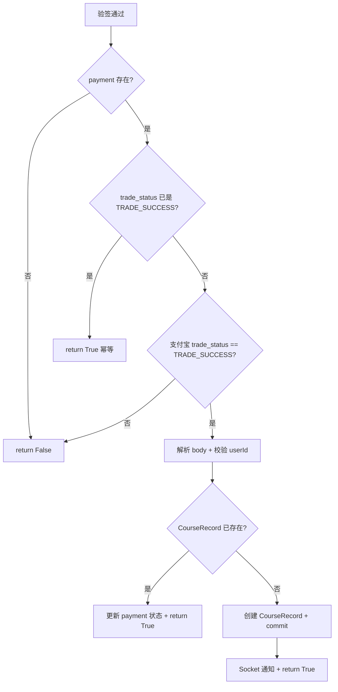

# 答辩前优化设计说明书

> 日期：2026-06-24
> 范围：支付幂等、AI 安全校验、Chat 流式体验、Agent 性能缓存
> 目标：在 Phase 1 核心安全已完成的基础上，补齐答辩演示路径上的剩余风险与体验问题
> 前置文档：[2026-06-23-phase1-stability-fixes-design.md](./2026-06-23-phase1-stability-fixes-design.md)

---

## 1. 背景与动机

### 1.1 Phase 1 完成情况

Phase 1（稳定性修复）的核心安全项 **已 100% 完成**：

| 项目 | 状态 |
|------|------|
| bcrypt 密码迁移 | 已完成 |
| Socket CORS 收紧 + JWT 鉴权 | 已完成 |
| 头像上传鉴权 + 文件校验 | 已完成 |
| XSS（DOMPurify） | 已完成 |
| 登录/注册/AI chat 限流 | 已完成 |
| JWT 15 分钟时效 | 已完成 |
| 支付回调返回值 success/failure | 已完成（Task 24） |
| Three.js onUnmounted 清理 | 已完成 |

### 1.2 剩余问题（本 spec 要解决的）

经代码审查与 Phase 1 复盘，以下 4 项在答辩演示路径上仍有实质风险或体验问题：

| # | 问题 | 严重度 | 类型 |
|---|------|--------|------|
| 1 | 支付回调无幂等，重复通知可能重复开课 | 高 | 安全/数据一致性 |
| 2 | Chat API 未校验 `role` 与 conversation 一致，可越权启用工具 | 高 | 安全 |
| 3 | ChatArea 流式渲染三 bug（key / scroll / Set 响应式） | 中 | 体验/正确性 |
| 4 | 每次聊天 `create_react_agent` 冷启动，首 token 慢 | 中 | 性能 |

### 1.3 明确不在本 spec 范围

以下项已识别但 **答辩后** 再做，避免 scope creep：

- SSE 401 流中途 refresh retry（15min token 下触发概率低）
- tracker / refresh-token 限流
- Three.js login/register 切换模型 dispose（unmount 已清理）
- 推荐服务 SQL 聚合（16 查询 → GROUP BY）
- Element Plus / highlight.js 按需引入
- 裸 Exception 全局 envelope、logger 替换 print_exc
- 前端 MD5 → 明文密码改造

---

## 2. 范围边界

### 2.1 改造范围

| 模块 | 路径 | 改动 |
|------|------|------|
| 支付回调 | `server/app/services/pay.py` | 幂等逻辑 |
| Chat 路由 | `server/ai/routers/chat.py` | role 校验 |
| Chat Schema | `server/ai/schemas/chat.py` | role 枚举 |
| Agent 服务 | `server/ai/services/chat.py` | Agent 缓存 |
| Chat 消息区 | `apps/web/src/views/Chat/components/ChatArea.vue` | key / scroll / expandedTools |
| Chat 消息组件 | `apps/web/src/views/Chat/components/ChatMessage.vue` | markdown computed |
| 共享类型 | `packages/common/chat/index.ts` | 可选 `id` 字段 |

### 2.2 禁止修改

- 全局 Layout / Header
- Pinia store 结构（`stores/chat.ts` 不改架构，仅类型扩展）
- 数据库 schema / Alembic 迁移（幂等靠业务逻辑 + 现有唯一约束）
- Chat UI 视觉（角色剧场 spec 独立）
- 其他业务页面（词库、课程、设置）

---

## 3. 功能设计

### 3.1 支付回调幂等

#### 现状

[`server/app/services/pay.py`](../../../server/app/services/pay.py) 的 `handle_payment_notify`：

1. 验签通过后，**不检查**支付宝 `trade_status` 字段
2. **不判断** `PaymentRecord` 是否已为 `TRADE_SUCCESS`
3. 每次回调都创建新的 `CourseRecord`
4. `body["userId"]` 未与 `payment.user_id` 交叉校验

支付宝在网络抖动时会 **重复发送** 同一笔交易的成功通知。当前逻辑会导致：

- 重复插入 `CourseRecord` → 触发 `uq_course_record_user_course` 唯一约束异常
- 或在不回滚的情况下产生不一致状态

Task 24 仅修复了返回值（`success` / `failure`），**未做幂等**。

#### 方案

在查到 `payment` 之后，按以下顺序处理：



**具体规则**：

1. **已处理短路**：`payment.trade_status == TradeStatus.TRADE_SUCCESS` → 直接 `return True`（支付宝重试时仍回 success，符合支付宝规范）
2. **状态过滤**：`form_data.get("trade_status") != "TRADE_SUCCESS"` → `return False`
3. **userId 绑定**：`body["userId"]` 必须等于 `payment.user_id`，否则 `return False` 并 rollback
4. **CourseRecord 双重检查**：插入前查询 `(user_id, course_id)` 是否已有记录
5. **IntegrityError 兜底**：commit 时捕获唯一约束冲突 → rollback → `return True`（视为已处理）

**不新增数据库字段**。依赖现有：

- `PaymentRecord.trade_status`（Enum）
- `CourseRecord` 唯一约束 `uq_course_record_user_course`

#### 验收标准

- 同一 `out_trade_no` 连续两次合法 notify → 仅一条 `CourseRecord`，两次均返回 `success`
- `trade_status=TRADE_CLOSED` 的 notify → 返回 `failure`，payment 状态不变
- `body.userId` 与 payment 不匹配 → 返回 `failure`，无 CourseRecord

---

### 3.2 Chat role 校验

#### 现状

[`server/ai/routers/chat.py`](../../../server/ai/routers/chat.py) 校验了：

- JWT 认证
- `conversationId` 归属当前用户

**未校验** `data.role == conversation.role`。

[`server/ai/schemas/chat.py`](../../../server/ai/schemas/chat.py) 中 `role: str = "normal"` 为任意字符串，而 [`conversation.py`](../../../server/ai/schemas/conversation.py) 已用 `Literal[...]` 枚举。

**攻击场景**：用户在 `master` 对话的 URL 下，POST `{ role: "normal", ... }` → 后端以 `normal` 角色创建 agent 并挂载全部 AI 工具（查词、语法、搜索、进度、推荐），绕过角色隔离设计。

#### 方案

**后端强制以 conversation.role 为准**（推荐，最安全）：

```python
# chat.py — 查到 conversation 后
if data.role != conversation.role:
    raise HTTPException(status_code=400, detail="角色与对话不匹配")

chat_data = data.model_dump()
chat_data["role"] = conversation.role  # 强制覆盖，忽略客户端
chat_data["userId"] = user["userId"]
```

**Schema 收紧**：

```python
# ai/schemas/chat.py
from typing import Literal

class ChatRequest(BaseModel):
    role: Literal['normal', 'master', 'business', 'qilinge', 'xiaoman'] = "normal"
    # ... 其余不变
```

前端 [`ChatArea.vue`](../../../apps/web/src/views/Chat/components/ChatArea.vue) 已传 `chatStore.activeRole`，无需改动；校验是防御性后端措施。

#### 验收标准

- 在 `master` 对话 POST `{ role: "normal" }` → HTTP 400
- 正常同 role 聊天 → SSE 流式正常
- 5 个角色各自对话 → tool 仅在 `normal` 可用

---

### 3.3 ChatArea 流式渲染优化

#### 现状

[`ChatArea.vue`](../../../apps/web/src/views/Chat/components/ChatArea.vue) 三个已确认问题：

| 问题 | 位置 | 影响 |
|------|------|------|
| `:key="index"` | 模板第 16 行 | 流式插入 tool 消息时 DOM 错乱、气泡闪烁 |
| 每个 SSE token 调用 `scrollToBottom()` | 回调第 196-203 行 | CPU 浪费，长回复卡顿 |
| `expandedTools` Set 原地 mutate | 第 80-83 行 | Vue 3 不追踪 Set 变更，展开/折叠可能不更新 UI |

[`ChatMessage.vue`](../../../apps/web/src/views/Chat/components/ChatMessage.vue) 额外问题：

- 模板内直接 `parseMarkdown(item.content)`，每次 re-render 重复解析

#### 方案

**3.3.1 稳定消息 key**

在 `packages/common/chat/index.ts` 的 `ChatMessage` 类型增加：

```typescript
id?: string  // 消息唯一标识，用于 v-for :key
```

发送消息时分配 id：

| 消息类型 | id 生成规则 |
|----------|-------------|
| 用户消息 | `human-${Date.now()}` |
| AI 消息 | `ai-${Date.now()}` |
| tool 消息 | `tool-${data.id}`（SSE 已有 run_id） |

模板改为 `:key="item.id ?? index"`（兼容历史消息无 id 的情况）。

**3.3.2 expandedTools 响应式**

改为 `ref<Record<string, boolean>>({})`：

```typescript
const expandedTools = ref<Record<string, boolean>>({})

const toggleToolExpand = (toolId: string | undefined) => {
    if (!toolId) return
    expandedTools.value = {
        ...expandedTools.value,
        [toolId]: !expandedTools.value[toolId],
    }
}
```

模板 `:expanded="!!expandedTools[item.toolId ?? '']"`。

**3.3.3 滚动节流**

使用 `pendingForce` 标记 + rAF 合并，避免闭包捕获 `force` 导致发消息后强制滚动无法被流式 `false` 调用覆盖的问题：

```typescript
let scrollRafId: number | null = null
let pendingForce = false

function scrollToBottom(force = false) {
    if (force) pendingForce = true
    if (scrollRafId !== null) return  // 已有 pending rAF，合并为一次执行
    scrollRafId = requestAnimationFrame(() => {
        scrollRafId = null
        const f = pendingForce
        pendingForce = false
        const el = chatRef.value?.parentElement?.parentElement
        if (!el) return
        if (!f) {
            const isNearBottom = el.scrollHeight - el.scrollTop - el.clientHeight < 150
            if (!isNearBottom) return
        }
        chatRef.value?.scrollIntoView({ behavior: 'smooth' })
    })
}
```

`onUnmounted` 时 `cancelAnimationFrame(scrollRafId)` 并重置 `pendingForce = false`。

**3.3.4 Markdown computed**

`ChatMessage.vue` 中：

```typescript
const renderedHtml = computed(() =>
    props.item.streaming ? '' : parseMarkdown(props.item.content)
)
```

模板：`v-html="renderedHtml"`（streaming 态仍用纯文本 + cursor）。

#### 验收标准

- 流式对话中触发 tool 调用 → 消息不错位、不闪烁
- 点击 tool 展开/折叠 → UI 立即响应
- 长回复流式输出 → DevTools Performance 中 scroll 调用次数显著减少
- 历史消息加载 → 正常渲染 markdown

---

### 3.4 Agent 缓存

#### 现状

[`server/ai/services/chat.py`](../../../server/ai/services/chat.py) 第 84-89 行，**每次** SSE 请求都执行：

```python
agent = create_react_agent(model, tools, checkpointer, prompt=SystemMessage(content=prompt))
```

LangGraph agent 编译是重量级操作。LLM 实例已有 `_llm_cache`（[`llm.py`](../../../server/ai/services/llm.py)），但 agent 未缓存。

#### 安全约束（必读）

[`make_tools(user_id)`](../../../server/ai/services/tools/__init__.py) 中 `progress_query` 和 `course_recommendation` 通过**闭包**绑定 `user_id`：

```python
# tools/progress.py — user_id 在工厂函数创建时捕获
def make_progress_query(user_id: str):
    @tool
    async def progress_query() -> str:
        select(User).where(User.id == user_id)  # 闭包引用
```

若缓存 `normal` 角色的 agent，第一个用户的 `user_id` 会被烘焙进 tool 实例，后续所有用户调用进度/推荐 tool 时会读到**第一个用户的数据** — 严重数据串号。

因此：**`normal` 角色禁止缓存**，每次请求必须 `make_tools(user_id)` + `create_react_agent`。

其余 4 角色 tools 为空列表 `[]`，无 per-user 状态，可安全缓存。

#### 方案

**缓存策略**：

```python
_agent_cache: dict[tuple, Any] = {}

def _agent_cache_key(role: str, deep_think: bool, web_search: bool) -> tuple | None:
    if web_search:
        return None  # web_search 动态追加 prompt，不缓存
    if role == "normal":
        return None  # per-user tools（闭包捕获 user_id），禁止缓存
    return (role, deep_think)
```

| 角色 | tools | 是否缓存 | cache key |
|------|-------|----------|-----------|
| `normal` | `make_tools(user_id)` 含闭包 | **不缓存** | — |
| `master` / `business` / `qilinge` / `xiaoman` | `[]` | **缓存** | `(role, deep_think)` |
| 任意 + `web_search=True` | — | **不缓存** | — |

最多 **8 个**缓存实例（4 role × 2 deep_think）。

**缓存内容**：编译后的 agent graph 实例。checkpointer 仍为全局单例，agent 创建时传入同一 checkpointer。

**prompt 来源**：`get_prompt_by_role(role)["prompt"]` — 固定 per role，不含用户输入。

**获取 agent 逻辑**：

```python
cache_key = _agent_cache_key(role, deep_think, web_search)
if cache_key and cache_key in _agent_cache:
    agent = _agent_cache[cache_key]
else:
    tools = make_tools(user_id) if role == "normal" else []
    agent = create_react_agent(model, tools, checkpointer, prompt=SystemMessage(content=prompt))
    if cache_key:
        _agent_cache[cache_key] = agent
```

**可选预热**（非必须）：`ai/main.py` lifespan 中预创建 `(master, False)` 等无 tools 角色 agent — **不得预热 normal**。

#### 风险与约束

- **内存**：最多 8 个 agent 实例常驻，可接受（答辩环境单 worker）
- **prompt 变更**：修改 `prompt.py` 后需重启服务（或提供 cache clear 函数，本 spec 不要求）
- **normal 不缓存**：牺牲 normal 角色的编译缓存，换取 user_id 隔离；性能收益集中在 4 个无 tools 角色
- **答辩后可选优化**：将 `user_id` 从闭包改为 LangGraph `configurable` 上下文，再评估 normal 缓存

#### 验收标准

- `master` 等同 role 连续两次聊天 → 第二次首 token 明显更快
- `normal` 角色：用户 A、B 分别查询学习进度 → 各自看到自己的数据（无串号）
- `normal` 角色 tool 调用（查词、进度、推荐）→ 功能正常
- `web_search=True` 聊天 → 功能正常
- 5 角色 + deepThink 切换 → 均正常，无串 role 问题

---

## 4. 架构总览

```mermaid
flowchart TB
    subgraph batch1 [批次1 支付幂等]
        PayNotify[handle_payment_notify]
        PayNotify --> IdempotentCheck{已 TRADE_SUCCESS?}
        IdempotentCheck -->|是| ReturnSuccess[return True]
        IdempotentCheck -->|否| ValidateStatus[校验 trade_status + userId]
        ValidateStatus --> CreateRecord[创建 CourseRecord]
    end

    subgraph batch2 [批次2 role 校验]
        ChatRouter[chat.py POST]
        ChatRouter --> VerifyRole{role == conversation.role?}
        VerifyRole -->|否| HTTP400[400]
        VerifyRole -->|是| ForceRole[强制 conversation.role]
    end

    subgraph batch3 [批次3 ChatArea]
        SSE[SSE tokens]
        SSE --> StableKey[stable id key]
        SSE --> ThrottleScroll[rAF scroll]
        ToolExpand[tool expand] --> RecordBool[Record boolean]
    end

    subgraph batch4 [批次4 Agent 缓存]
        StreamChat[stream_chat]
        StreamChat --> IsNormal{role == normal?}
        IsNormal -->|是| AlwaysCreate[每次 create + make_tools]
        IsNormal -->|否| CacheLookup{cache hit?}
        CacheLookup -->|是| ReuseAgent[复用 agent]
        CacheLookup -->|否| CreateAgent[create_react_agent]
    end
```



---

## 5. 实施优先级

| 顺序 | 批次 | 预估工时 | 答辩必要性 |
|------|------|----------|------------|
| 1 | 支付幂等 | 30 min | 必须（支付 demo 不能翻车） |
| 2 | Chat role 校验 | 20 min | 必须（安全演示） |
| 3 | ChatArea 快修 | 1 h | 必须（聊天 demo 体验） |
| 4 | Agent 缓存 | 1-2 h | 建议（AI 响应更快，改动稍大） |

**答辩最低交付**：批次 1-3。

---

## 6. 风险矩阵

| 风险 | 概率 | 影响 | 缓解 |
|------|------|------|------|
| 幂等逻辑遗漏 edge case | 低 | 中 | IntegrityError 兜底 + 手动重复 notify 测试 |
| Agent 缓存导致 role 串用 | 低 | 高 | key 含 role；web_search 不缓存 |
| Agent 缓存导致 user_id 串号 | 中 | **严重** | **normal 禁止缓存**；闭包 tool 不可共享 |
| 消息 id 与历史消息不兼容 | 低 | 低 | `:key="item.id ?? index"` 降级 |
| Agent 缓存内存增长 | 极低 | 低 | 最多 8 实例，单 worker |

---

## 7. 测试策略

本项目无自动化测试基础设施。验收采用 **手动 smoke test**：

```bash
pnpm all   # web:8080 + server:3000 + ai:3001
```

| 场景 | 操作 | 预期 |
|------|------|------|
| 支付幂等 | 沙箱支付成功后，手动重放 notify | 一次 CourseRecord，两次 success |
| role 越权 | master 对话 curl role=normal | 400 |
| 流式 tool | normal 角色查词 | 消息不错位，tool 可展开 |
| Agent 缓存 | master 同 role 连发两条消息 | 第二条响应更快 |
| user_id 隔离 | 用户 A、B 分别在 normal 查进度 | 各看到自己的数据 |

---

## 8. 关联文档

| 文档 | 关系 |
|------|------|
| [2026-06-23-phase1-stability-fixes-design.md](./2026-06-23-phase1-stability-fixes-design.md) | 前置，本 spec 是其补充 |
| [2026-06-23-chat-role-theatre-design.md](./2026-06-23-chat-role-theatre-design.md) | 并行，UI 视觉独立 |
| [2026-06-24-pre-defense-optimization.md](../plans/2026-06-24-pre-defense-optimization.md) | 本 spec 的实施计划 |

---

## 9. 审批

- [ ] 设计范围确认（4 项 in scope，7 项 out of scope）
- [ ] 支付幂等方案确认
- [ ] Chat role 强制覆盖方案确认
- [ ] ChatArea 改动范围确认（不改 store 架构）
- [ ] Agent 缓存策略确认（normal 不缓存；web_search 不缓存；仅 4 无 tools 角色缓存）
- [ ] 批准进入实施计划阶段
