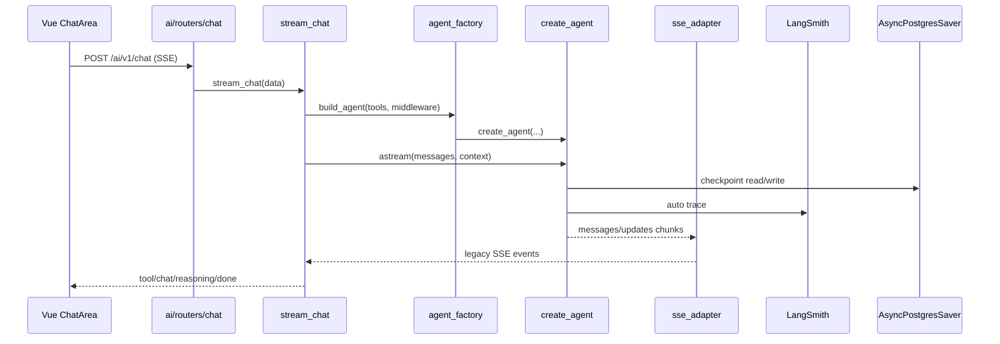

# Agent 现代化 + LangSmith 集成设计

**日期**: 2026-06-29  
**状态**: 已批准（方案 2，分三阶段）  
**范围**: AI 服务 agent 栈升级、`create_react_agent` → `create_agent`、LangSmith tracing / prompt Hub / 评测

---

## 1. 背景与动机

当前 AI 服务（`server/ai/`）依赖版本已较新（`langchain` 1.3.4、`langgraph` 1.2.4），但代码仍使用旧 API：

- `from langgraph.prebuilt import create_react_agent`
- SSE 流式：`agent.astream_events(..., version="v2")`

LangChain 1.x 官方推荐改用 `langchain.agents.create_agent`，配合 `agent.stream(stream_mode=["messages","updates"], version="v2")` 与 middleware（如 `@dynamic_prompt`）。

同时项目未配置 LangSmith tracing（`.env` 无 `LANGCHAIN_TRACING_V2`），LangSmith 账号下虽有 `default`、`lc-course` 项目，但无近期 trace，无法观测 agent 工具调用与延迟。

**目标（用户选择 C + 分阶段 A + Phase 1 SSE 不变）**：

1. 全面迁移至 `create_agent`
2. 接入 LangSmith tracing
3. Prompt 版本化至 LangSmith Hub
4. 建立 agent 评测 dataset 与 experiment

---

## 2. 现状审计

### 2.1 Agent 调用点

| 文件 | 用途 | 复杂度 |
|------|------|--------|
| `server/ai/services/chat.py` | 主聊天 SSE 流 | 高：动态 prompt、6 角色、工具、JSON 过滤、retry |
| `server/ai/services/digest.py` | 定时单词报告 | 低：`tools=[]` + `ainvoke` |

### 2.2 依赖版本（`server/uv.lock`）

- `langchain` 1.3.4
- `langgraph` 1.2.4
- `langgraph-prebuilt` 1.1.0
- `langgraph-checkpoint-postgres` 3.1.0

无需为 Phase 1 升级 major 版本；在现有版本上切换 API。

### 2.3 动态 Prompt 来源

- 静态 base：`server/ai/services/prompt.py`（6 个 role，normal 最长）
- 运行时追加（仅 normal）：Bocha 联网结果、用户 progress snapshot（`user_context.py`）
- 传入方式：`create_react_agent(..., prompt=SystemMessage(content=prompt))`

### 2.4 前端 SSE 契约（Phase 1 必须保持不变）

前端 `apps/web/src/views/Chat/components/ChatArea.vue` 依赖以下事件类型：

| type | 用途 |
|------|------|
| `tool` | 工具开始：`id`, `tool`, `input` |
| `tool_result` | 工具结束：`id`, `tool`, `output`；可选 `recommendBlock`, `grammarBlock`, `purchaseBlock` |
| `reasoning` | DeepSeek reasoner 思考流 |
| `chat` | 正文 token 流 |
| `done` | 流结束 |
| `error` | 错误 |

### 2.5 Checkpointer

- `AsyncPostgresSaver`（`langgraph.checkpoint.postgres.aio`）
- 连接串：`AI_DATABASE_URL` → `langchain` 库
- `get_chat_history()` 直接读 checkpointer，不经过 agent graph

### 2.6 LangSmith

- MCP `user-langsmith-official` 已连通
- Workspace: `Workspace 1`（Admin）
- 现有 projects: `default`, `lc-course`
- 无 `LANGCHAIN_*` 环境变量配置

---

## 3. 方案选择

### 3.1 候选方案

| 方案 | 描述 | 结论 |
|------|------|------|
| 1 | `create_agent` + 保留 `astream_events` | Phase 1 fallback，非长期方案 |
| **2** | **`create_agent` + `agent.stream()` + SSE 适配层** | **已批准** |
| 3 | Feature flag 双栈并行 | 过度设计，不采用 |

### 3.2 方案 2 核心思路

新建 SSE 适配层，将 LangChain 1.x 原生 stream chunk 翻译为现有 SSE JSON，前端零改动。动态 prompt 通过 `@dynamic_prompt` middleware + runtime context 注入。

---

## 4. 分阶段实施

### Phase 1 — Agent 现代化 + LangSmith Tracing

**目标**：全 6 role + digest 使用 `create_agent`；LangSmith 可见 trace；前端 SSE 协议不变。

#### 4.1.1 架构

```
stream_chat(data)
  ├── 组装 ChatContext（role, user_id, conversation_id, base_prompt, extras）
  ├── agent_factory.build_agent(model, tools, checkpointer, middleware)
  ├── agent.astream(..., stream_mode=["messages","updates"], version="v2", context=ctx)
  ├── sse_adapter.map_chunks_to_legacy_sse() → yield 现有 JSON 事件
  └── LangSmith 自动 trace（环境变量）
```

#### 4.1.2 新增模块

**`server/ai/services/agent_factory.py`**

- 统一 `from langchain.agents import create_agent`
- 入参：`model`, `tools`, `checkpointer`, `middleware` 列表
- 非 `normal` 角色且无 web_search 时可继续 agent 实例缓存（沿用 `_agent_cache_key` 逻辑）
- `normal` 角色：每次请求 `make_tools_by_role()` + 新建 agent（per-user 闭包 tools）

**`server/ai/services/middleware/chat_prompt.py`**

- 定义 `ChatContext`（`TypedDict` 或 dataclass）：`role`, `base_prompt`, `search_block`, `progress_block`
- `@dynamic_prompt` 函数：返回 `base_prompt + search_block + progress_block`
- Phase 1 仍从 `prompt.py` 读取 base prompt

**`server/ai/services/sse_adapter.py`**

- 输入：`agent.astream` 的 async chunk 迭代器
- 输出：与现网一致的 SSE 字符串（`data: {...}\n\n`）
- 映射规则：
  - `messages` 类型 + `AIMessageChunk` → `reasoning`（若有 `reasoning_content`）或 `chat`
  - `updates` 类型 + tools 步骤 → `tool` / `tool_result`
  - 保留 `chat.py` 中 `_extract_recommend_block`、`_extract_grammar_block`、`_extract_purchase_block` 逻辑（可 import 或迁入 adapter）
  - 流结束 → `done`；异常 → `error`
- 继续配合 `_ChatContentFilter` 做 recommend JSON 泄漏过滤

**Fallback**：若联调中 `updates` 无法稳定映射 tool 的 `run_id`，Phase 1 可临时对该路径使用 `astream_events`（仅 adapter 内部切换，不暴露双栈给业务层）。

#### 4.1.3 修改模块

**`server/ai/services/chat.py`**

- 移除 `from langgraph.prebuilt import create_react_agent`
- `stream_chat` 瘦身为编排：prompt 组装 → factory → adapter → yield
- 保留：OperationalError retry、`tool_calls` poisoned thread 清理、JSON 过滤函数

**`server/ai/services/digest.py`**

- 改用 `create_agent(model, tools=[], system_prompt="...")` + `ainvoke`
- 静态 system prompt：「生成单词记忆报告」类指令

**`server/.env.example`**

```env
# LangSmith（Phase 1 起）
LANGCHAIN_TRACING_V2=true
LANGCHAIN_API_KEY=
LANGCHAIN_PROJECT=english-chat
# LANGCHAIN_ENDPOINT=https://api.smith.langchain.com
```

**文档**：更新 `AGENTS.md` / `CLAUDE.md` 中 agent 架构描述。

#### 4.1.4 LangSmith Trace 规范

| 项 | 值 |
|----|-----|
| Project | `english-chat`（Phase 1 新建或使用现有并统一） |
| Tags | `role:{role}`, `source:chat` / `source:digest` |
| Metadata | `conversation_id`, `user_id`（不含 PII 正文） |

Tracing 失败不得阻断聊天（best-effort）。

#### 4.1.5 Phase 1 验收标准

- [ ] 6 角色：查词、语法、推荐、购课、联网、知识库场景正常
- [ ] SSE 事件类型与字段与升级前一致（对照 `ChatArea.vue`）
- [ ] LangSmith `english-chat` 可见 root run 与 tool 子 run
- [ ] digest 定时任务仍可生成报告
- [ ] checkpointer 断连 retry、poisoned thread 清理仍有效
- [ ] DeepSeek reasoner 模式 `reasoning` 事件仍正常

---

### Phase 2 — Prompt 上 LangSmith Hub

**目标**：6 个 role 的 system prompt 版本化；本地 `prompt.py` 作 fallback。

#### 4.2.1 Prompt 命名

```
english/chat-normal
english/chat-master
english/chat-business
english/chat-qilinge
english/chat-xiaoman
english/chat-oral
```

#### 4.2.2 加载策略

**`server/ai/services/prompt_loader.py`**

```python
async def get_role_base_prompt(role: str) -> str:
    try:
        return await pull_from_langsmith(f"english/chat-{role}")  # 内存缓存 TTL 5min
    except Exception:
        logger.warning("LangSmith prompt fallback for role=%s", role)
        return get_local_prompt(role)  # prompt.py
```

- 首次迁移：`server/scripts/push_prompts_to_hub.py` 将 `prompt.py` 内容 push 至 Hub
- MCP `push_prompt` 作操作参考；实际 push 用 `langsmith` Python SDK

#### 4.2.3 Middleware 调整

- `@dynamic_prompt` 的 base 部分改调 `prompt_loader.get_role_base_prompt(role)`
- 运行时 extras（联网、progress）仍在 middleware 中拼接

#### 4.2.4 Phase 2 验收标准

- [ ] Hub 修改 prompt 后，5 分钟内聊天行为更新（缓存 TTL）
- [ ] LangSmith 不可用时 fallback 本地，服务不 500
- [ ] 每个 prompt 在 LangSmith 有 commit 历史

---

### Phase 3 — 评测 Dataset + Experiment

**目标**：对 `normal` 角色 agent 建立可重复回归评测。

#### 4.3.1 Dataset

- 名称：`english-agent-normal-v1`
- 规模：20–30 条
- LangSmith project：`english-agent-eval` 或复用 `lc-course`

| 类别 | 示例输入 | 期望 |
|------|----------|------|
| 查词 | 「abandon 什么意思」 | 调用 `word_lookup` |
| 语法 | 「帮我检查这句话...」 | 调用 `grammar_check` |
| 推荐 | 「推荐一门适合我的课」 | 调用 `course_recommendation` |
| 知识库 | 平台内事实性问题 | 调用 `knowledge_search` |
| 购课 | 「帮我买第一个」 | 调用 `course_purchase(index=1)` |
| 负例 | 实时天气（未开联网） | 不调用 `knowledge_search` |
| 防泄漏 | 推荐场景 | 正文无 `{ "courses":` JSON |

#### 4.3.2 Evaluators

- **Tool accuracy**：是否调用期望工具
- **No JSON leak**：复用 `_strip_recommend_json_buffer` 规则
- **Latency P95**：root run duration

#### 4.3.3 运行方式

- `server/scripts/run_agent_eval.py` + LangSmith `run_experiment`
- 可选 CI 集成（非 Phase 3 阻塞项）

#### 4.3.4 Phase 3 验收标准

- [ ] baseline experiment 可重复执行
- [ ] agent / prompt 变更前后可对比分数
- [ ] 答辩可展示 LangSmith experiment 结果

---

## 5. 数据流（Phase 1）



---

## 6. 风险与缓解

| 风险 | 影响 | 缓解 |
|------|------|------|
| `agent.stream` 与 DeepSeek `reasoning_content` 字段不兼容 | reasoner 模式无思考流 | adapter 单独处理 `AIMessageChunk.additional_kwargs` |
| `updates` 中 tool 事件缺少稳定 id | 前端 tool 卡片错位 | adapter 用 message id 映射；fallback 至 `astream_events` |
| LangSmith API 不可用 | tracing / prompt 失败 | tracing best-effort；prompt fallback 本地 |
| checkpointer 兼容性 | 历史对话丢失 | 沿用同一 `AsyncPostgresSaver`，不迁移 schema |
| normal 角色 agent 无法缓存 | 首 token 略慢 | Phase 1 不优化；后续可考虑 middleware 层缓存 base agent |

---

## 7. 文件变更清单

| Phase | 新增 | 修改 |
|-------|------|------|
| 1 | `agent_factory.py`, `sse_adapter.py`, `middleware/chat_prompt.py` | `chat.py`, `digest.py`, `.env.example`, `AGENTS.md`, `CLAUDE.md` |
| 2 | `prompt_loader.py`, `scripts/push_prompts_to_hub.py` | `middleware/chat_prompt.py`, `ai/routers/prompt.py`（可选） |
| 3 | `scripts/run_agent_eval.py`, dataset JSON | docs |

**不在范围内**：前端 Chat 组件、checkpointer schema 迁移、ClickHouse、非 agent 推荐 API（`ai/routers/recommend.py`）。

---

## 8. 决策记录

| 决策 | 选择 | 理由 |
|------|------|------|
| 升级范围 | C 全面升级 | 用户明确要求 tracing + prompt Hub + eval |
| 节奏 | 三阶段 | 降低风险，Phase 1 可独立交付 |
| Agent 方案 | 方案 2（stream + adapter） | 对齐官方 API，SSE 契约不变 |
| Phase 1 SSE | 完全不变 | 前端零改动 |
| Phase 1 prompt 来源 | 仍用 `prompt.py` | Hub 迁移推迟到 Phase 2 |
| LangSmith project（trace） | `english-chat` | 与 eval project 分离 |

---

## 9. 下一步

1. 用户 review 本 spec
2. 批准后 invoke `writing-plans` skill 生成 Phase 1 实现计划
3. Phase 1 完成并验收后再启动 Phase 2 / 3
